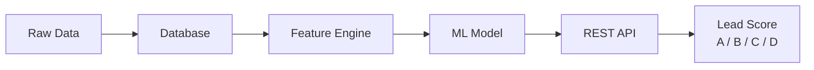

# ML Lead Scoring System

An automated system that analyzes lead behavior to predict which prospects are most likely to convert, helping sales teams prioritize their outreach.

## System Diagram



## Key Features

- Automated lead scoring based on behavioral signals
- REST API for real-time single and batch scoring
- A/B/C/D bucket classification for sales prioritization
- Prediction logging with explainability (top contributing factors)
- Hot-reloadable model without server restart

## Quick Start

**Prerequisites:** Docker, Docker Compose, Python 3.13+, Poetry

**Step 1 — Clone and install**
```bash
git clone <repo-url> lead-scoring
cd lead-scoring
poetry install
```

**Step 2 — Start the database**
```bash
docker compose up postgres -d
```

**Step 3 — Run migrations**
```bash
poetry run alembic upgrade head
```

**Step 4 — Download dataset**

Download the Kaggle Lead Scoring dataset and place the CSV at:
```
data/Lead Scoring.csv
```

**Step 5 — Seed the database**
```bash
poetry run python scripts/seed_db.py
```

**Step 6 — Generate events**
```bash
poetry run python scripts/generate_events.py
```

**Step 7 — Train the model**
```bash
poetry run python scripts/train.py --set-active
```

**Step 8 — Start the API**
```bash
poetry run uvicorn src.api.main:app --port 8000
```

**Step 9 — Test it**
```bash
curl -X POST http://localhost:8000/score/{lead_id}
```

> **Note:** The ML application runs on your machine; only the database runs in a container. To run everything in containers instead, use `docker compose up`.

## Project Structure

```
lead-scoring/
├── src/
│   ├── api/          # FastAPI application
│   ├── ml/           # ML training pipeline
│   ├── models/       # SQLAlchemy ORM models
│   └── services/     # Business logic (scoring, features, ingestion)
├── config/           # Settings and YAML configs
├── scripts/          # CLI tools (seed, train, generate events)
├── tests/            # Unit and integration tests
├── alembic/          # Database migrations
├── models/           # Trained model artifacts
├── data/             # Dataset files
├── notebooks/        # Exploration notebooks
├── docs/             # Technical documentation
├── compose.yaml      # Docker Compose config
└── Dockerfile        # Container build
```

## Documentation

- [Architecture](docs/architecture.md) — system design, component responsibilities, request lifecycle
- [Data Pipeline](docs/data-pipeline.md) — raw data source, cleaning, database ingestion
- [ML Model](docs/ml-model.md) — feature engineering, training, evaluation, serialization
- [API Reference](docs/api.md) — endpoints, middleware, error handling
- [Configuration](docs/configuration.md) — environment variables, YAML configs
- [Database](docs/database.md) — schema, migrations, connection management
- [Deployment](docs/deployment.md) — containers, local dev, production architecture

## Tech Stack

| Component | Technology |
|---|---|
| Language | Python 3.13 |
| API Framework | FastAPI |
| ML Model | XGBoost (scikit-learn pipeline) |
| Database | PostgreSQL 15 |
| ORM | SQLAlchemy 2.0 (async) |
| Migrations | Alembic |
| Containerization | Docker, Docker Compose |
| Logging | structlog |
