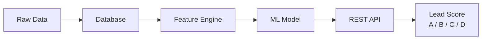

# ML Lead Scoring System

An automated system that analyzes lead behavior to predict which prospects are most likely to convert, helping sales teams prioritize their outreach.

[Documentation Website](http://asong65335.me/lead-scoring/)

## Key Features

- Automated lead scoring based on behavioral signals
- REST API for real-time single and batch scoring
- A/B/C/D bucket classification for sales prioritization
- Prediction logging with explainability (top contributing factors)
- Hot-reloadable model without server restart
- Bidirectional HubSpot CRM integration with webhook-triggered rescoring

## Tech Stack

| Component | Technology |
|---|---|
| Language | Python 3.13 |
| API Framework | FastAPI |
| ML Model | XGBoost (scikit-learn pipeline) |
| Explainability | SHAP (TreeExplainer) |
| Database | PostgreSQL 15 |
| ORM | SQLAlchemy 2.0 (async) |
| Migrations | Alembic |
| Reverse Proxy | Nginx |
| Containerization | Docker, Docker Compose |
| Logging | structlog |

## System Diagram


```mermaid
flowchart LR
    A[Raw Data] --> B[Database]
    B --> C[Feature Engine]
    C --> D[ML Model]
    D --> E[REST API]
    E --> F[Lead Score\nA / B / C / D]
```

## Project Structure

```
lead-scoring/
├── src/
│   ├── api/          # FastAPI application, middleware, routes
│   ├── ml/           # ML training, evaluation, SHAP explainability
│   ├── models/       # SQLAlchemy ORM models
│   └── services/     # Scoring, features, ingestion, CRM sync
├── config/           # Pydantic settings, features.yaml, crm.yaml, nginx.conf
├── scripts/          # CLI tools (seed, train, retrain, batch score, backup)
├── tests/            # Unit, integration, and e2e tests
├── alembic/          # Database migrations
├── models/           # Trained model artifacts (.joblib)
├── data/             # Kaggle dataset CSV
├── backups/          # Database backup dumps
├── notebooks/        # Exploration notebooks
├── docs/             # Technical documentation and runbook
├── Makefile          # Bootstrap and operational targets
├── compose.yaml      # Docker Compose (nginx, app, postgres, scripts)
├── Dockerfile        # Multi-stage container build
├── pyproject.toml    # Dependencies and project metadata
└── .env.example      # Environment variable template
```

## Quick Start

**Prerequisites:** Docker, Docker Compose, Make

**Step 1 — Clone and configure**

```bash
git clone https://github.com/asong65535/lead-scoring.git lead-scoring && cd lead-scoring
cp .env.example .env
```

**Step 2 — Download the dataset**

Download the [Kaggle Lead Scoring dataset](https://www.kaggle.com/datasets/amritachatterjee09/lead-scoring-dataset/data) and place the CSV at:

```
data/Lead Scoring.csv
```

**Step 3 — Bootstrap**

```bash
make bootstrap
```

This builds containers, runs migrations, seeds the database, generates synthetic events, trains the model, and starts the full stack. Takes 2–5 minutes.

**Step 4 — Create an API key**

```bash
docker compose run --rm scripts python scripts/manage_keys.py create --name dev
```

Save the printed key — it cannot be recovered.

**Step 5 — Test it**

```bash
# Get a lead ID
docker compose exec postgres psql -U postgres -d lead_scoring \
  -t -c "SELECT id FROM leads LIMIT 1"

# Score it (replace <key> and <lead-id>)
curl -X POST http://localhost/score/<lead-id> \
  -H "Authorization: Bearer <key>"
```

The API is available at **http://localhost** (port 80, Nginx reverse proxy).
