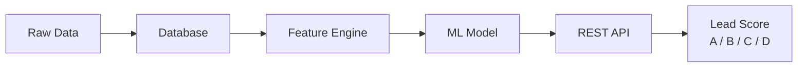

# ML Lead Scoring System

An automated system that analyzes lead behavior to predict which prospects are most likely to convert, helping sales teams prioritize their outreach.

## System Diagram


```mermaid
flowchart LR
    A[Raw Data] --> B[Database]
    B --> C[Feature Engine]
    C --> D[ML Model]
    D --> E[REST API]
    E --> F[Lead Score\nA / B / C / D]
```

## Key Features

- Automated lead scoring based on behavioral signals
- REST API for real-time single and batch scoring
- A/B/C/D bucket classification for sales prioritization
- Prediction logging with explainability (top contributing factors)
- Hot-reloadable model without server restart
- Bidirectional HubSpot CRM integration with webhook-triggered rescoring

## Quick Start

**Prerequisites:** Docker, Docker Compose, Make

**Option 1 — One command (recommended)**

```bash
git clone https://github.com/asong65535/lead-scoring.git lead-scoring && cd lead-scoring
cp .env.example .env
make bootstrap
```

This builds containers, runs migrations, seeds the database, generates synthetic events, trains the model, and starts the full stack. Takes 2–5 minutes.

**Option 2 — Step by step**

```bash
cp .env.example .env
docker compose up -d postgres          # start database
docker compose run --rm scripts alembic upgrade head  # migrations
docker compose run --rm scripts python scripts/seed_db.py
docker compose run --rm scripts python scripts/generate_events.py
docker compose run --rm scripts python scripts/train.py --set-active
docker compose up -d                   # start app + nginx
```

**Create an API key**

```bash
docker compose run --rm scripts python scripts/manage_keys.py create --name dev
```

Save the printed key — it cannot be recovered.

**Test it**

```bash
# Get a lead ID
docker compose exec postgres psql -U postgres -d lead_scoring \
  -t -c "SELECT id FROM leads LIMIT 1"

# Score it (replace <key> and <lead-id>)
curl -X POST http://localhost/score/<lead-id> \
  -H "Authorization: Bearer <key>"
```

The API is available at **http://localhost:80**

> **Without Docker:** You can run the app directly with Poetry — see [Deployment](docs/deployment.md) for the host-based workflow.

## Project Structure

```
lead-scoring/
├── src/
│   ├── api/          # FastAPI application
│   ├── ml/           # ML training pipeline
│   ├── models/       # SQLAlchemy ORM models
│   └── services/     # Business logic (scoring, features, ingestion, CRM sync)
├── config/           # Settings and YAML configs
├── scripts/          # CLI tools (seed, train, generate events)
├── tests/            # Unit and integration tests
├── alembic/          # Database migrations
├── models/           # Trained model artifacts
├── data/             # Dataset files
├── notebooks/        # Exploration notebooks
├── docs/             # Technical documentation
├── compose.yaml      # Docker Compose config
└── Dockerfile        # Container build
```

## Documentation

- [Architecture](docs/architecture.md) — system design, component responsibilities, request lifecycle
- [Data Pipeline](docs/data-pipeline.md) — raw data source, cleaning, database ingestion
- [ML Model](docs/ml-model.md) — feature engineering, training, evaluation, serialization
- [API Reference](docs/api.md) — endpoints, middleware, error handling
- [CRM Integration](docs/crm-integration.md) — HubSpot sync, webhooks, field mapping, retry logic
- [Configuration](docs/configuration.md) — environment variables, YAML configs
- [Database](docs/database.md) — schema, migrations, connection management
- [Deployment](docs/deployment.md) — containers, local dev, production architecture
- [Operational Runbook](docs/runbook.md) — health checks, troubleshooting, rollback, backup/restore

## Tech Stack

| Component | Technology |
|---|---|
| Language | Python 3.13 |
| API Framework | FastAPI |
| ML Model | XGBoost (scikit-learn pipeline) |
| Database | PostgreSQL 15 |
| ORM | SQLAlchemy 2.0 (async) |
| Migrations | Alembic |
| Containerization | Docker, Docker Compose |
| Logging | structlog |
