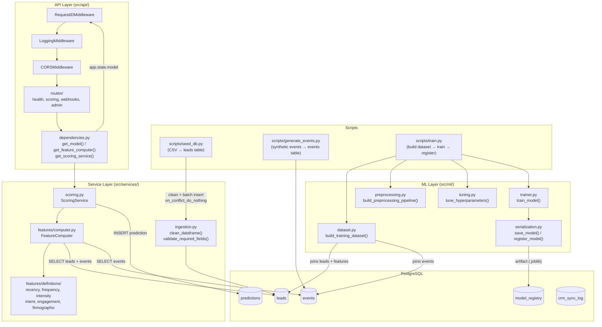

# Architecture

## Overview

The lead scoring system ingests lead data from a Kaggle CSV, computes behavioral features derived from synthetic engagement events, trains an XGBoost classification model, and exposes real-time scoring via a FastAPI REST API. PostgreSQL persists leads, behavioral events, predictions, model registry entries, and CRM sync logs. The pipeline runs end-to-end from raw CSV to a live HTTP scoring endpoint with no manual data wrangling steps.

---

## System Diagram



---

## Component Responsibilities

### `src/api/`

FastAPI application factory, middleware stack, routers, exception handlers, and dependency injection. See [API Reference](api.md).

### `src/ml/`

XGBoost training pipeline: dataset assembly, preprocessing, hyperparameter tuning, model serialization, and model registry management. See [ML Model](ml-model.md).

### `src/models/`

SQLAlchemy ORM models for all database tables (`Lead`, `Event`, `Prediction`, `ModelRegistry`, `CrmSyncLog`). See [Database](database.md).

### `src/services/scoring.py`

`ScoringService` is the scoring orchestrator. It accepts a `lead_id`, calls `FeatureComputer.compute()` to build a feature dict, runs the sklearn `Pipeline.predict_proba()`, assigns a bucket (A/B/C/D) based on configurable thresholds, extracts the top 5 feature importances as `top_factors`, and inserts a `Prediction` row then commits. Returns a `ScoreResult` dataclass. Also supports `score_leads()` for batch scoring in a single DB round-trip.

Bucket thresholds (defaults): A ≥ 0.70, B ≥ 0.40, C ≥ 0.20, D < 0.20. Thresholds are configurable via `config/settings.py`.

### `src/services/features/`

`FeatureComputer` in `computer.py` is engine-scoped and owns its own `async_sessionmaker`. On `compute(lead_id)`, it eagerly loads the `Lead` and its `events` via `selectinload` in a single query, then delegates to registered feature functions from `definitions/`. Feature categories: recency, frequency, intensity, intent, engagement, firmographic. `registry.py` maps feature names defined in `features.yaml` to their Python callables. `validation.py` validates computed values and applies defaults for any missing or out-of-range features.

### `src/services/ingestion.py`

Two public functions:

- `clean_dataframe(df)` — orchestrates four cleaning steps in order: (1) `replace_placeholders` strips whitespace and replaces `"Select"`/empty strings with `NaN`; (2) `convert_booleans` maps `Yes/No` and `0/1` to Python bools; (3) `coerce_numerics` coerces `TotalVisits`, `Total Time Spent on Website`, `Page Views Per Visit` to float; (4) `rename_columns` maps Kaggle CSV column names to DB column names and drops unmapped columns.
- `validate_required_fields(df)` — splits the cleaned DataFrame into `(valid, rejected)` on whether `external_id` is non-null and non-empty.

### `config/`

Pydantic `BaseSettings` backed by environment variables and YAML config files. See [Configuration](configuration.md).

### `scripts/seed_db.py`

Reads `data/Lead Scoring.csv`, pipes the DataFrame through `clean_dataframe()` and `validate_required_fields()`, attaches `source_system="kaggle"` to each row, and batch-inserts into the `leads` table in chunks of 500 (`BATCH_SIZE=500`). Uses PostgreSQL `INSERT ... ON CONFLICT DO NOTHING` keyed on `external_id`, so the script is safe to re-run. NaN floats are coerced to `None` before insertion to satisfy asyncpg. Returns a summary dict with row counts and null percentages per column.

```
poetry run python scripts/seed_db.py
```

### `scripts/train.py`

Orchestrates the full training workflow:

1. `build_training_dataset(engine)` — queries leads with computed features, splits into train/test sets.
2. `build_preprocessing_pipeline()` — constructs the sklearn preprocessing steps.
3. _(optional)_ `tune_hyperparameters(X_train, y_train, pipeline)` — runs hyperparameter search; rebuilds pipeline after.
4. `train_model(X_train, y_train, X_test, y_test, pipeline, hyperparameters)` — fits the full pipeline and evaluates.
5. `save_model(...)` — serializes the fitted pipeline to a `.joblib` artifact.
6. `register_model(engine, ...)` — inserts a row into `model_registry`. If `--set-active` is passed, marks the new model as the active version.

CLI flags:

- `--tune` — run hyperparameter tuning before training.
- `--set-active` — mark the trained model as active in the registry (required before the API will load it).

```
poetry run python scripts/train.py [--tune] [--set-active]
```

### `scripts/generate_events.py`

Generates synthetic behavioral events for all leads that have no existing events (idempotent — skips leads that already have events). Event types: `page_view`, `email_open`, `email_click`, `form_submission`, `email_unsubscribe`. Converted leads receive 15–50 events with density biased toward the end of the time window; non-converted leads receive 3–20 events with flat/declining density. Event proportions differ between the two groups — converted leads get higher `email_click` and `form_submission` rates, non-converted get higher `email_unsubscribe` rates. Page views within 30 minutes inherit the same `session_id`. Inserts in batches of 500. Also writes `converted_at` timestamps back to converted leads.

```
poetry run python scripts/generate_events.py
```

> Note: `routes/contacts.py` was not implemented — no contacts CRUD endpoints exist.

---

## Request Lifecycle

Step-by-step walkthrough of `POST /score/{lead_id}`:

1. **RequestIDMiddleware** — reads `X-Request-ID` from the incoming request headers or generates a new UUID. Attaches it to `request.state.request_id` and propagates it in the response headers.
2. **LoggingMiddleware** — records the request start time before passing to the next layer.
3. **CORSMiddleware** — handles CORS preflight and injects response headers.
4. **FastAPI routing** — dispatches to `scoring.router` → `score_lead()` handler.
5. **Dependency injection** — `get_model(request)` reads `app.state.model` and `app.state.model_version` (raises `ModelNotLoadedError` → 503 if absent); `get_feature_computer()` instantiates a `FeatureComputer` with the shared async engine; `get_scoring_service()` assembles `ScoringService` with the model, version, feature computer, per-request session, and bucket thresholds from settings.
6. **ScoringService.score_lead(lead_id)**:
   - `FeatureComputer.compute(lead_id)` — loads lead + events in one query, runs all registered feature functions, validates, returns feature dict.
   - `model.predict_proba(df)` — runs inference through the sklearn pipeline.
   - `assign_bucket(score, ...)` — maps probability to A/B/C/D.
   - `top_factors(...)` — extracts the 5 features with highest absolute importance.
   - `session.add(Prediction(...))` + `session.commit()` — persists the prediction row.
7. **Returns `ScoreResponse` JSON** — includes `lead_id`, `score`, `bucket`, `model_version`, `top_factors`, `scored_at`.
8. **LoggingMiddleware** — logs method, path, status code, and `duration_ms` at response time.

---

## Key Design Decisions

- **Async SQLAlchemy 2.0 + asyncpg** — all DB I/O is non-blocking; the engine is shared at module level and reused across requests.
- **Raw ASGI middleware** — `RequestIDMiddleware` and `LoggingMiddleware` are plain ASGI callables rather than Starlette `BaseHTTPMiddleware` subclasses, avoiding the double-buffering overhead of the higher-level API.
- **In-process model loading** — at startup, `lifespan` queries `model_registry` for the active model and loads the artifact into `app.state.model`. No separate model server; inference runs in-process.
- **Three DI scopes** — application-state (model, loaded once at startup), engine-scoped (`FeatureComputer`, one per request but sharing the module-level engine), and per-request (`AsyncSession`, created and closed for each request via `get_session`).
