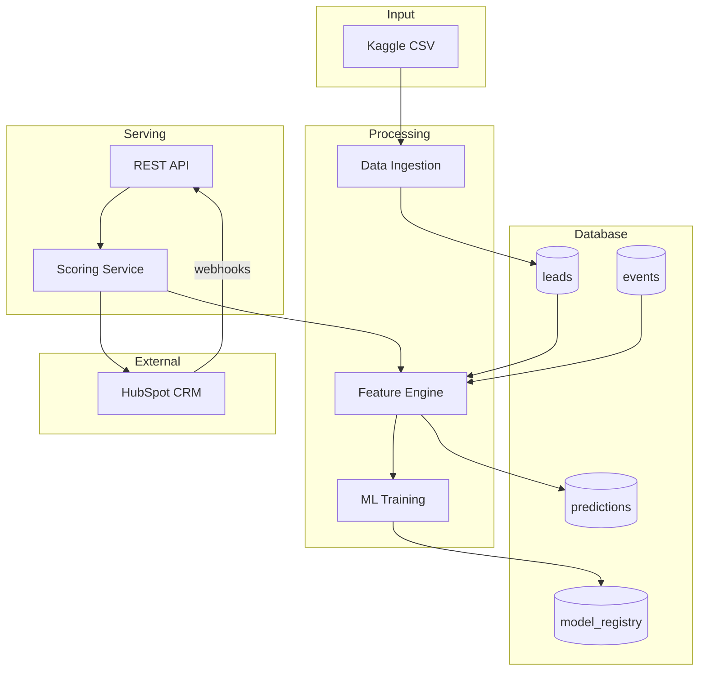
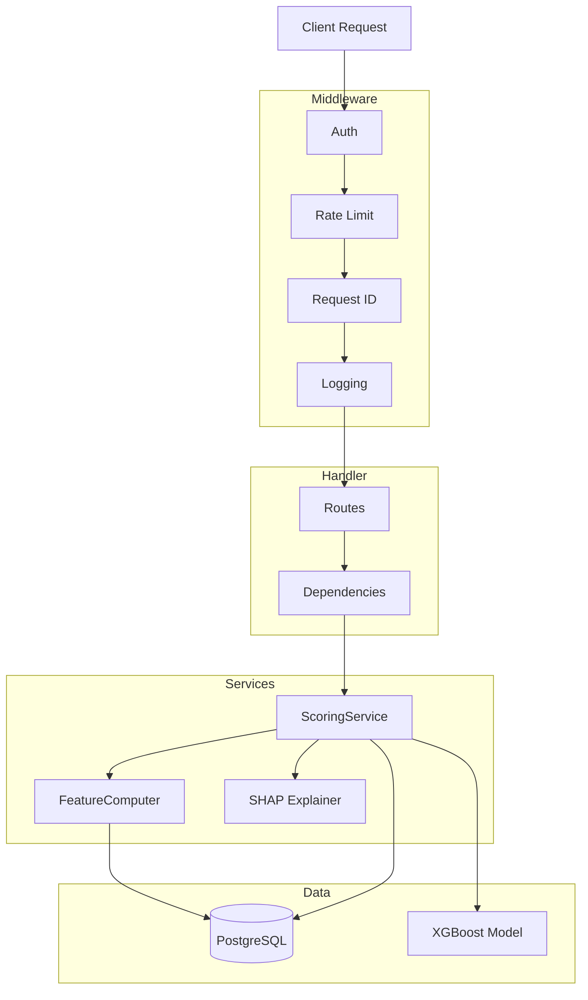
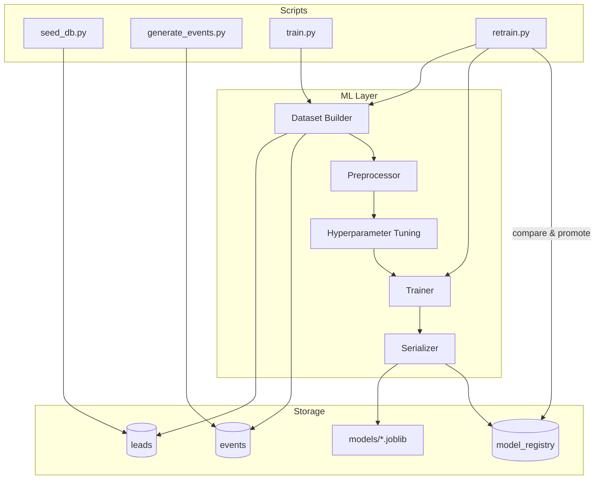

# Architecture

## Overview

The lead scoring system ingests lead data from a Kaggle CSV, computes behavioral features derived from synthetic engagement events, trains an XGBoost classification model, and exposes real-time scoring via a FastAPI REST API. PostgreSQL persists leads, behavioral events, predictions, model registry entries, and CRM sync logs. The pipeline runs end-to-end from raw CSV to a live HTTP scoring endpoint with no manual data wrangling steps.

---

## System Diagram

### High-Level Data Flow


```mermaid
flowchart TB
    subgraph Input
        csv[Kaggle CSV]
    end

    subgraph Database
        leads[(leads)]
        events[(events)]
        predictions[(predictions)]
        registry[(model_registry)]
    end

    subgraph Processing
        ingestion[Data Ingestion]
        features[Feature Engine]
        training[ML Training]
    end

    subgraph Serving
        api[REST API]
        scoring[Scoring Service]
    end

    subgraph External
        hubspot[HubSpot CRM]
    end

    csv --> ingestion --> leads
    leads --> features
    events --> features
    features --> training --> registry
    
    api --> scoring
    scoring --> features
    features --> predictions
    scoring --> hubspot
    hubspot -->|webhooks| api
```

### Request Flow


```mermaid
flowchart TB
    client[Client Request]
    
    subgraph Middleware
        auth[Auth]
        rate[Rate Limit]
        reqid[Request ID]
        log[Logging]
    end
    
    subgraph Handler
        routes[Routes]
        deps[Dependencies]
    end
    
    subgraph Services
        scoring[ScoringService]
        features[FeatureComputer]
        explainer[SHAP Explainer]
    end
    
    subgraph Data
        db[(PostgreSQL)]
        model[XGBoost Model]
    end

    client --> auth --> rate --> reqid --> log --> routes
    routes --> deps --> scoring
    scoring --> features --> db
    scoring --> model
    scoring --> explainer
    scoring --> db
```

### Training Pipeline


```mermaid
flowchart TB
    subgraph Scripts
        seed[seed_db.py]
        genevents[generate_events.py]
        train[train.py]
        retrain[retrain.py]
    end

    subgraph ML Layer
        dataset[Dataset Builder]
        preprocess[Preprocessor]
        tuning[Hyperparameter Tuning]
        trainer[Trainer]
        serializer[Serializer]
    end

    subgraph Storage
        leads[(leads)]
        events[(events)]
        registry[(model_registry)]
        artifacts[models/*.joblib]
    end

    seed --> leads
    genevents --> events
    
    train --> dataset
    dataset --> leads
    dataset --> events
    dataset --> preprocess --> tuning --> trainer --> serializer
    serializer --> artifacts
    serializer --> registry
    
    retrain --> dataset
    retrain --> trainer
    retrain -->|compare & promote| registry
```

---

## Component Responsibilities

### `src/api/`

FastAPI application factory, middleware stack, routers, exception handlers, and dependency injection. See [API Reference](api.md).

### `src/ml/`

XGBoost training pipeline: dataset assembly, preprocessing, hyperparameter tuning, model serialization, model registry management, and SHAP-based explainability. See [ML Model](ml-model.md).

### `src/models/`

SQLAlchemy ORM models for all database tables (`Lead`, `Event`, `Prediction`, `ModelRegistry`, `CrmSyncLog`, `APIKey`, `RetrainingRun`). See [Database](database.md).

### `src/services/scoring.py`

`ScoringService` is the scoring orchestrator. It accepts a `lead_id`, calls `FeatureComputer.compute()` to build a feature dict, runs the sklearn `Pipeline.predict_proba()`, assigns a bucket (A/B/C/D) based on configurable thresholds, and inserts a `Prediction` row then commits. Returns a `ScoreResult` dataclass. Also supports `score_leads()` for batch scoring, which returns a 3-tuple: `(results, missing_ids, errors)` where `errors` is a list of `(lead_id, error_message)` tuples for leads that failed during scoring (partial failure support).

When an `Explainer` is provided (the default in the API), `top_factors` contains per-prediction SHAP values — sample-specific feature contributions showing how each feature pushed the score up or down for *this particular lead*. Without an explainer, it falls back to global feature importance from the XGBoost model.

Bucket thresholds (defaults): A ≥ 0.70, B ≥ 0.40, C ≥ 0.20, D < 0.20. Thresholds are configurable via `config/settings.py`.

### `src/services/features/`

`FeatureComputer` in `computer.py` is engine-scoped and owns its own `async_sessionmaker`. On `compute(lead_id)`, it eagerly loads the `Lead` and its `events` via `selectinload` in a single query, then delegates to registered feature functions from `definitions/`. Events are pre-bucketed by type into a `dict[str, list[Event]]` (with a special `"_all"` key for the full list) before being passed to feature functions, avoiding redundant per-function filtering. Individual feature computations are wrapped in try/catch — if a feature function raises, the error is logged and `validate_features()` applies the YAML default for that feature. Feature categories: recency, frequency, intensity, intent, engagement, firmographic. `registry.py` maps feature names defined in `features.yaml` to their Python callables. `validation.py` validates computed values and applies defaults for any missing or out-of-range features. `compute_batch()` returns `dict[UUID, dict]` keyed by lead_id.

### `src/services/crm/`

CRM integration layer for bidirectional sync between the scoring system and external CRM platforms. See [CRM Integration](crm-integration.md) for full details.

- **`base.py`** — Abstract base class (`CRMClient`) defining the CRM client interface: `push_score()`, `fetch_contact()`, `fetch_contacts()`, `validate_webhook()`, `parse_webhook_event()`. Also defines the `WebhookEvent` dataclass.
- **`factory.py`** — Factory function (`get_crm_client()`) that returns the appropriate `CRMClient` implementation based on settings. Returns `None` if CRM is disabled.
- **`hubspot.py`** — `HubSpotClient` implementation using the HubSpot REST API. Handles OAuth, score property updates, contact fetching, webhook signature validation (v3), and event parsing.
- **`sync.py`** — `CRMSyncService` orchestrates score writeback. Called fire-and-forget from `ScoringService.score_lead()` after a prediction is committed. Writes a `CRMSyncLog` row for every attempt (success or failure) for auditability. Only triggers for leads with `source_system` in `{"hubspot", "salesforce"}`.
- **`retry.py`** — `RetryService` sweeps `crm_sync_log` rows with `status="failed"` and `retry_count < max_retries`, re-attempts the push, and updates the log row. Designed to be called from a cron job or scheduled task.
- **`errors.py`** — CRM-specific exception hierarchy (`CRMError`, `CRMAuthError`, `CRMRateLimitError`, `CRMContactNotFoundError`, `CRMWritebackError`).
- **`mock.py`** — `MockCRMClient` test double that records all calls for assertion.

Webhook processing (`src/api/routes/webhooks.py`): validates the incoming webhook signature via the CRM client, parses events, filters against `rescore_triggers` from settings, debounces against recent predictions (configurable window), and rescores matching leads.

### `src/ml/comparison.py`

Compares candidate model metrics against the active model. Primary gate: AUC-ROC must not drop more than 5% relative. Secondary gate: calibration error must not increase more than 0.05 absolute. Returns `ComparisonResult` with promote/block decision and per-metric deltas.

### `src/ml/drift.py`

PSI-based drift detection. Computes Population Stability Index per feature by comparing training-time baselines against recent prediction feature snapshots. Also tracks prediction score distribution shifts. Returns `DriftResult` with drifted features flagged.

### `src/ml/alerts.py`

Webhook alerting. POSTs JSON payloads to a configurable URL for retrain outcomes (`retrain.success`, `retrain.blocked`, `retrain.failed`) and drift detection (`drift.detected`). Fire-and-forget — delivery failure is logged but never blocks the pipeline.

### `src/services/ingestion.py`

Two public functions:

- `clean_dataframe(df)` — orchestrates four cleaning steps in order: (1) `replace_placeholders` strips whitespace and replaces `"Select"`/empty strings with `NaN`; (2) `convert_booleans` maps `Yes/No` and `0/1` to Python bools; (3) `coerce_numerics` coerces `TotalVisits`, `Total Time Spent on Website`, `Page Views Per Visit` to float; (4) `rename_columns` maps Kaggle CSV column names to DB column names and drops unmapped columns.
- `validate_required_fields(df)` — splits the cleaned DataFrame into `(valid, rejected)` on whether `external_id` is non-null and non-empty.

### `config/`

Pydantic `BaseSettings` backed by environment variables and YAML config files. See [Configuration](configuration.md).

### `scripts/seed_db.py`

Reads `data/Lead Scoring.csv`, pipes the DataFrame through `clean_dataframe()` and `validate_required_fields()`, attaches `source_system="kaggle"` to each row, and batch-inserts into the `leads` table in chunks of 500 (`BATCH_SIZE=500`). Uses PostgreSQL `INSERT ... ON CONFLICT DO NOTHING` keyed on `external_id`, so the script is safe to re-run. NaN floats are coerced to `None` before insertion to satisfy asyncpg. Returns a summary dict with row counts and null percentages per column.

```
poetry run python scripts/seed_db.py
```

### `scripts/train.py`

Orchestrates the full training workflow:

1. `build_training_dataset(engine)` — queries leads with computed features, splits into train/test sets.
2. `build_preprocessing_pipeline()` — constructs the sklearn preprocessing steps.
3. _(optional)_ `tune_hyperparameters(X_train, y_train, pipeline)` — runs hyperparameter search; rebuilds pipeline after.
4. `train_model(X_train, y_train, X_test, y_test, pipeline, hyperparameters)` — fits the full pipeline and evaluates.
5. `save_model(...)` — serializes the fitted pipeline to a `.joblib` artifact.
6. `register_model(engine, ...)` — inserts a row into `model_registry`. If `--set-active` is passed, marks the new model as the active version.

CLI flags:

- `--tune` — run hyperparameter tuning before training.
- `--set-active` — mark the trained model as active in the registry (required before the API will load it).

```
poetry run python scripts/train.py [--tune] [--set-active]
```

### `scripts/batch_score.py`

Standalone CLI worker for nightly batch scoring. Queries all leads (or only those modified since a given timestamp), chunks them, and scores each chunk via `ScoringService.score_leads()`. Each chunk gets its own DB session. Optionally triggers CRM writeback for scored leads.

CLI flags:

- `--chunk-size N` — leads per batch (default: 500).
- `--since YYYY-MM-DD` — only score leads with `updated_at` after this date.
- `--skip-crm` — disable CRM writeback even if configured.
- `--dry-run` — compute scores without persisting predictions or writing back to CRM. Uses a savepoint + rollback to exercise the full pipeline without side effects.

Prints a summary with total scored, errors, bucket distribution, and elapsed time.

```
poetry run python scripts/batch_score.py [--chunk-size 200] [--since 2026-03-01] [--skip-crm] [--dry-run]
```

### `scripts/retrain.py`

Orchestrates the full retraining pipeline. Loads the active model for comparison, runs drift detection against recent predictions, builds a fresh training dataset, trains a new model, compares metrics (AUC-ROC must not drop >5% relative, calibration error must not increase >0.05 absolute), and promotes or blocks the candidate. Every run is persisted to the `retraining_runs` table. Alerts via webhook on success, block, failure, or significant drift.

CLI flags: `--tune`, `--force`, `--dry-run`.

```bash
docker compose run --rm app python scripts/retrain.py [--tune] [--force] [--dry-run]
```

### `scripts/generate_events.py`

Generates synthetic behavioral events for all leads that have no existing events (idempotent — skips leads that already have events). Event types: `page_view`, `email_open`, `email_click`, `form_submission`, `email_unsubscribe`. Converted leads receive 15–50 events with density biased toward the end of the time window; non-converted leads receive 3–20 events with flat/declining density. Event proportions differ between the two groups — converted leads get higher `email_click` and `form_submission` rates, non-converted get higher `email_unsubscribe` rates. Page views within 30 minutes inherit the same `session_id`. Inserts in batches of 500. Also writes `converted_at` timestamps back to converted leads.

```
poetry run python scripts/generate_events.py
```

> Note: `routes/contacts.py` was not implemented — no contacts CRUD endpoints exist.

---

## Request Lifecycle

Step-by-step walkthrough of `POST /score/{lead_id}`:

1. **AuthMiddleware** — validates the Bearer token in the `Authorization` header. Hashes the token with SHA-256 and queries the `api_keys` table for a matching active key. Returns 401 if missing or invalid. Exempt paths (health probes, docs) skip this check.
2. **RateLimitMiddleware** — checks the client IP against the sliding-window rate limiter. Returns 429 if the limit is exceeded.
3. **RequestIDMiddleware** — reads `X-Request-ID` from the incoming request headers or generates a new UUID. Attaches it to `request.state.request_id` and propagates it in the response headers.
4. **LoggingMiddleware** — records the request start time before passing to the next layer.
5. **FastAPI routing** — dispatches to `scoring.router` → `score_lead()` handler.
6. **Dependency injection** — `get_model(request)` reads `app.state.model` and `app.state.model_version` (raises `ModelNotLoadedError` → 503 if absent); `get_feature_computer()` instantiates a `FeatureComputer` with the shared async engine; `get_scoring_service()` assembles `ScoringService` with the model, version, feature computer, per-request session, bucket thresholds from settings, and the `Explainer` from `app.state.explainer`.
7. **ScoringService.score_lead(lead_id)**:
   - `FeatureComputer.compute(lead_id)` — loads lead + events in one query, runs all registered feature functions, validates, returns feature dict.
   - `model.predict_proba(df)` — runs inference through the sklearn pipeline.
   - `assign_bucket(score, ...)` — maps probability to A/B/C/D.
   - `Explainer.explain(df)` — computes per-sample SHAP values and returns the top 5 factors by absolute impact. Falls back to global feature importance if no explainer is available.
   - `session.add(Prediction(...))` + `session.commit()` — persists the prediction row.
8. **Returns `ScoreResponse` JSON** — includes `lead_id`, `score`, `bucket`, `model_version`, `top_factors`, `scored_at`.
9. **LoggingMiddleware** — logs method, path, status code, and `duration_ms` at response time.

---

## Key Design Decisions

- **Async SQLAlchemy 2.0 + asyncpg** — all DB I/O is non-blocking; the engine is shared at module level and reused across requests.
- **Raw ASGI middleware** — All custom middlewares (`RequestIDMiddleware`, `LoggingMiddleware`, `RateLimitMiddleware`, `AuthMiddleware`) are plain ASGI callables rather than Starlette `BaseHTTPMiddleware` subclasses, avoiding the double-buffering overhead of the higher-level API.
- **API key authentication** — Bearer token auth with SHA-256 hashing. Only the hash is stored in the database; raw keys are shown once at creation and cannot be recovered. Auth runs before rate limiting so invalid tokens are rejected immediately without consuming rate limit budget.
- **In-process model loading** — at startup, `lifespan` queries `model_registry` for the active model and loads the artifact into `app.state.model`. If loading fails, the app starts in degraded mode (scoring returns 503). Model reloads are protected by an `asyncio.Lock` and validated for correct Pipeline structure before being swapped in.
- **Resilient DB connections** — the async engine uses `pool_timeout=30` (fail fast instead of hanging) and `pool_pre_ping=True` (detect stale connections after DB restarts).
- **Fault-tolerant feature computation** — individual feature function failures are caught and logged; the validation layer fills in YAML defaults for missing features, so a single bad feature doesn't block scoring.
- **Three DI scopes** — application-state (model, loaded once at startup), engine-scoped (`FeatureComputer`, one per request but sharing the module-level engine), and per-request (`AsyncSession`, created and closed for each request via `get_session`).
- **SHAP TreeExplainer** — the `Explainer` wraps SHAP's `TreeExplainer` for per-prediction feature contributions. Instantiated once at startup alongside the model (and refreshed on model reload). TreeExplainer uses the XGBoost tree structure directly, making it fast enough for real-time scoring without approximation.

---

## Operational Reference

For day-to-day operations (health checks, troubleshooting, model rollback, backup/restore), see the [Operational Runbook](runbook.md).
