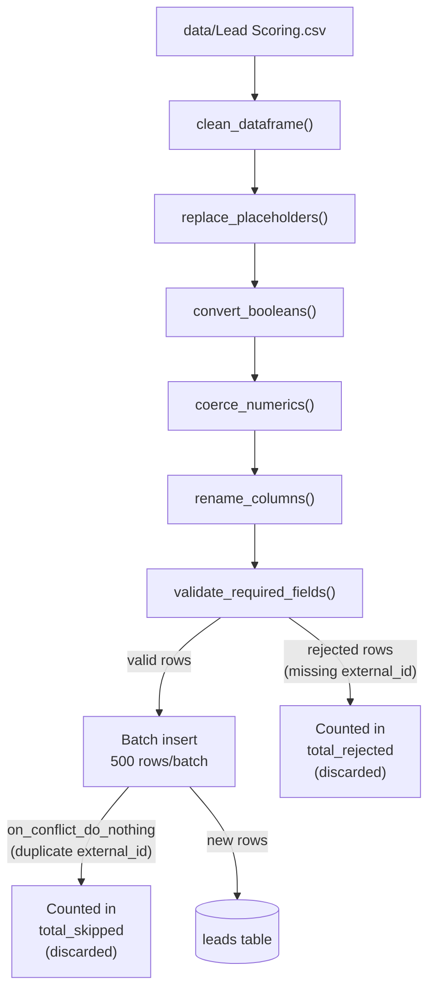

# Data Pipeline

Covers raw data ingestion from CSV into the `leads` table. Feature engineering is documented in [ml-model.md](ml-model.md).

---

## 1. Data Source

The dataset is the Kaggle ["Lead Scoring" dataset](https://www.kaggle.com/datasets/ashydv/leads-dataset). The CSV file must be placed at:

```
data/Lead Scoring.csv
```

The original dataset contains 37 columns. The `leads` table retains a direct subset of 15 columns — those carrying behavioral signals and demographic context relevant to conversion scoring. Administrative, free-text, and redundant columns from the original are discarded.

**Columns kept and their rationale:**

| CSV Column | DB Column | Rationale |
|---|---|---|
| `Prospect ID` | `external_id` | Stable identifier; used for deduplication |
| `Lead Origin` | `lead_origin` | Channel through which the lead entered |
| `Lead Source` | `lead_source` | Referring source (organic, paid, referral, etc.) |
| `Do Not Email` | `do_not_email` | Contact preference; affects reachability |
| `Do Not Call` | `do_not_call` | Contact preference; affects reachability |
| `Converted` | `converted` | Training label for the ML model |
| `TotalVisits` | `total_visits` | Behavioral: site engagement depth |
| `Total Time Spent on Website` | `total_time_spent` | Behavioral: site engagement duration |
| `Page Views Per Visit` | `page_views_per_visit` | Behavioral: browsing intensity |
| `Last Activity` | `last_activity` | Recency signal; most recent interaction type |
| `Country` | `country` | Demographic; geographic segment |
| `Specialization` | `specialization` | Demographic; area of professional interest |
| `What is your current occupation` | `current_occupation` | Demographic; employment status |
| `City` | `city` | Demographic; city-level geography |
| `Tags` | `tags` | CRM-assigned labels (e.g. "Interested in other courses") |

---

## 2. Cleaning & Transformation

All cleaning logic lives in `src/services/ingestion.py`. `clean_dataframe()` orchestrates four steps in order, all operating on CSV column names except the final rename step.

### `clean_dataframe()`

```
replace_placeholders → convert_booleans → coerce_numerics → rename_columns
```

**Step 1 — `replace_placeholders()`**

Strips leading/trailing whitespace from all string columns. Replaces empty strings and the literal value `"Select"` (case-insensitive) with `NaN`. These are form default values that carry no information.

**Step 2 — `convert_booleans()`**

- `Do Not Email` and `Do Not Call`: `"Yes"` → `True`, `"No"` → `False`, missing → `False`.
- `Converted`: integer `1`/`0` (and float equivalents) → `True`/`False`; missing values remain `NaN`.

**Step 3 — `coerce_numerics()`**

Applies `pd.to_numeric(..., errors="coerce")` to the three numeric columns (`TotalVisits`, `Total Time Spent on Website`, `Page Views Per Visit`). Invalid values become `NaN`.

**Step 4 — `rename_columns()`**

Renames columns using `COLUMN_MAP` and drops all columns not present in the map. After this step the DataFrame uses DB column names.

### `validate_required_fields()`

Splits the cleaned DataFrame into two partitions:

- **valid**: rows where `external_id` is non-null and non-empty after stripping whitespace.
- **rejected**: all other rows (missing or blank `Prospect ID`).

Only `valid` rows proceed to insertion. Rejected rows are counted and reported in the summary but are not written to the database.

---

## 3. DB Ingestion

Entry point: `scripts/seed_db.py`

```bash
poetry run python scripts/seed_db.py
```

**Constants**

| Name | Value |
|---|---|
| `CSV_PATH` | `data/Lead Scoring.csv` (relative to project root) |
| `BATCH_SIZE` | `500` rows per insert |

**Behavior**

- Sets `source_system = "kaggle"` on every row before insertion.
- Inserts in batches of 500 using `INSERT ... ON CONFLICT DO NOTHING` keyed on `external_id`. Rows that already exist in the database are silently skipped (counted as `total_skipped`).
- A final `NaN`-scrub pass converts any remaining `float('nan')` values to `None` before passing records to asyncpg.

**Return value / summary stats**

| Key | Description |
|---|---|
| `total_read` | Rows read from the CSV |
| `total_rejected` | Rows dropped by `validate_required_fields()` |
| `total_skipped` | Valid rows not inserted due to duplicate `external_id` |
| `total_inserted` | Rows successfully written to `leads` |
| `null_percentages` | Per-column null rate (%) across the valid set |
| `conversion_rate` | `converted == True` rate (%) across the valid set |

---

## 4. Data Flow Diagram



See [Database](database.md) for the full `leads` table schema.
