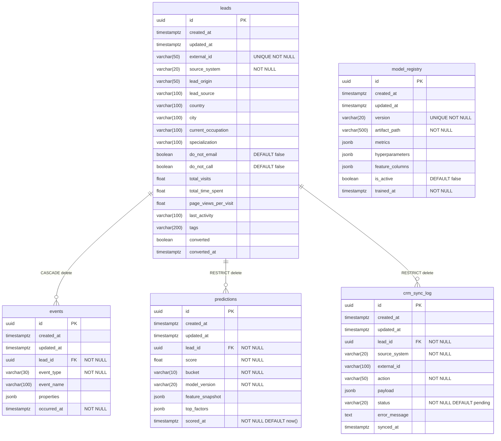

# Database Schema

PostgreSQL 15, async SQLAlchemy 2.0, asyncpg driver, Alembic migrations.

## Schema Overview

All five tables inherit `id`, `created_at`, and `updated_at` from `TimestampMixin` (see `src/models/base.py`). The `id` column is a UUID generated server-side via `gen_random_uuid()`.



> **TimestampMixin** (`src/models/base.py`): every table gets `id` (UUID PK, `gen_random_uuid()`), `created_at` (timestamptz, `now()`), and `updated_at` (timestamptz, `now()`, updated on each write via `onupdate`).

---

## Tables

### `leads`

Source: `src/models/lead.py`

| Column | Type | Nullable | Notes |
|---|---|---|---|
| `id` | UUID | NOT NULL | PK, server default `gen_random_uuid()` |
| `created_at` | timestamptz | NOT NULL | server default `now()` |
| `updated_at` | timestamptz | NOT NULL | server default `now()`, updated on write |
| `external_id` | VARCHAR(50) | NOT NULL | UNIQUE |
| `source_system` | VARCHAR(20) | NOT NULL | |
| `lead_origin` | VARCHAR(50) | NULL | |
| `lead_source` | VARCHAR(100) | NULL | |
| `country` | VARCHAR(100) | NULL | |
| `city` | VARCHAR(100) | NULL | |
| `current_occupation` | VARCHAR(100) | NULL | |
| `specialization` | VARCHAR(100) | NULL | |
| `do_not_email` | BOOLEAN | NOT NULL | default `false` |
| `do_not_call` | BOOLEAN | NOT NULL | default `false` |
| `total_visits` | FLOAT | NULL | |
| `total_time_spent` | FLOAT | NULL | |
| `page_views_per_visit` | FLOAT | NULL | |
| `last_activity` | VARCHAR(100) | NULL | |
| `tags` | VARCHAR(200) | NULL | |
| `converted` | BOOLEAN | NULL | |
| `converted_at` | timestamptz | NULL | added in migration `ca7959e931e2` |

**Indexes:**

| Name | Columns |
|---|---|
| `ix_leads_source_system` | `source_system` |
| `ix_leads_converted` | `converted` |

---

### `events`

Source: `src/models/event.py`

| Column | Type | Nullable | Notes |
|---|---|---|---|
| `id` | UUID | NOT NULL | PK, server default `gen_random_uuid()` |
| `created_at` | timestamptz | NOT NULL | server default `now()` |
| `updated_at` | timestamptz | NOT NULL | server default `now()`, updated on write |
| `lead_id` | UUID | NOT NULL | FK → `leads.id` ON DELETE CASCADE |
| `event_type` | VARCHAR(30) | NOT NULL | check constraint (see below) |
| `event_name` | VARCHAR(100) | NULL | |
| `properties` | JSONB | NULL | arbitrary event metadata |
| `occurred_at` | timestamptz | NOT NULL | |

**Check constraint** `ck_events_event_type`: `event_type IN ('page_view', 'email_open', 'email_click', 'form_submission', 'email_unsubscribe')`

**Indexes:**

| Name | Columns | Notes |
|---|---|---|
| `ix_events_lead_id_occurred_at` | `lead_id`, `occurred_at` | composite |
| `ix_events_event_type` | `event_type` | |

---

### `predictions`

Source: `src/models/prediction.py`

| Column | Type | Nullable | Notes |
|---|---|---|---|
| `id` | UUID | NOT NULL | PK, server default `gen_random_uuid()` |
| `created_at` | timestamptz | NOT NULL | server default `now()` |
| `updated_at` | timestamptz | NOT NULL | server default `now()`, updated on write |
| `lead_id` | UUID | NOT NULL | FK → `leads.id` ON DELETE RESTRICT |
| `score` | FLOAT | NOT NULL | probability score, 0.0–1.0 |
| `bucket` | VARCHAR(10) | NOT NULL | check constraint (see below) |
| `model_version` | VARCHAR(20) | NOT NULL | references `model_registry.version` (no FK) |
| `feature_snapshot` | JSONB | NULL | feature values at scoring time |
| `top_factors` | JSONB | NULL | SHAP or ranked feature contributions |
| `scored_at` | timestamptz | NOT NULL | server default `now()` |

**Check constraint** `ck_predictions_bucket`: `bucket IN ('A', 'B', 'C', 'D')`

**Indexes:**

| Name | Columns | Notes |
|---|---|---|
| `ix_predictions_lead_id` | `lead_id` | |
| `ix_predictions_scored_at` | `scored_at` | |
| `ix_predictions_lead_id_scored_at` | `lead_id`, `scored_at DESC` | composite, descending scored_at |
| `ix_predictions_model_version` | `model_version` | |

---

### `model_registry`

Source: `src/models/model_registry.py`

| Column | Type | Nullable | Notes |
|---|---|---|---|
| `id` | UUID | NOT NULL | PK, server default `gen_random_uuid()` |
| `created_at` | timestamptz | NOT NULL | server default `now()` |
| `updated_at` | timestamptz | NOT NULL | server default `now()`, updated on write |
| `version` | VARCHAR(20) | NOT NULL | UNIQUE |
| `artifact_path` | VARCHAR(500) | NOT NULL | filesystem or object-store path to model file |
| `metrics` | JSONB | NULL | evaluation metrics (e.g. AUC-ROC, F1) |
| `hyperparameters` | JSONB | NULL | training hyperparameters |
| `feature_columns` | JSONB | NULL | ordered list of feature names used at training |
| `is_active` | BOOLEAN | NOT NULL | default `false`; only one row should be `true` |
| `trained_at` | timestamptz | NOT NULL | |

**Indexes:**

| Name | Columns | Notes |
|---|---|---|
| `ix_model_registry_active` | `is_active` | partial index: `WHERE is_active = true` |

The partial index makes the active-model lookup (`WHERE is_active = true`) a single-row index scan.

---

### `crm_sync_log`

Source: `src/models/crm_sync_log.py`

| Column | Type | Nullable | Notes |
|---|---|---|---|
| `id` | UUID | NOT NULL | PK, server default `gen_random_uuid()` |
| `created_at` | timestamptz | NOT NULL | server default `now()` |
| `updated_at` | timestamptz | NOT NULL | server default `now()`, updated on write |
| `lead_id` | UUID | NOT NULL | FK → `leads.id` ON DELETE RESTRICT |
| `source_system` | VARCHAR(20) | NOT NULL | |
| `external_id` | VARCHAR(100) | NULL | CRM record ID in the external system |
| `action` | VARCHAR(50) | NOT NULL | e.g. `create`, `update` |
| `payload` | JSONB | NULL | request payload sent to CRM |
| `status` | VARCHAR(20) | NOT NULL | server default `'pending'`; check constraint |
| `error_message` | TEXT | NULL | populated on failure |
| `synced_at` | timestamptz | NULL | timestamp of successful sync |

**Check constraint** `ck_crm_sync_log_status`: `status IN ('success', 'failed', 'pending')`

**Indexes:**

| Name | Columns |
|---|---|
| `ix_crm_sync_log_lead_id` | `lead_id` |
| `ix_crm_sync_log_status` | `status` |
| `ix_crm_sync_log_source_external` | `source_system`, `external_id` |

> **Note:** This table has no active write paths yet. It is prepared for Phase 7 CRM integration.

---

## Migrations

Migrations live under `alembic/` and are configured in `alembic.ini`. The migration runner in `alembic/env.py` uses an async engine (`create_async_engine`) so migrations run against asyncpg. Offline mode uses `settings.database.sync_url`; online mode uses `settings.database.url`.

### Migration history

| Revision | Description |
|---|---|
| `49ec235a15ed` | Initial schema — creates `leads`, `model_registry`, `crm_sync_log`, `predictions` |
| `ca7959e931e2` | Adds `events` table and `converted_at` column to `leads` |

### Common commands

```bash
# Apply all pending migrations
alembic upgrade head

# Roll back the most recent migration
alembic downgrade -1

# Generate a new migration from ORM changes
alembic revision --autogenerate -m "description"

# Show current revision applied to the database
alembic current

# Show full migration history
alembic history
```

---

## Connection Management

Source: `src/models/database.py`

**Engine** — created with `create_async_engine` (asyncpg driver). Pool parameters come from `settings.database`:

| Parameter | Setting key |
|---|---|
| `pool_size` | `settings.database.pool_size` |
| `max_overflow` | `settings.database.max_overflow` |

**Session factory** — `AsyncSessionLocal` is an `async_sessionmaker` bound to the engine with `expire_on_commit=False`. Disabling expire-on-commit means ORM objects remain accessible after `session.commit()` without triggering lazy-load queries.

**`get_session()` dependency** — an async generator intended for FastAPI `Depends()`. It yields a session, rolls back on any exception, and closes the session on exit:

```python
async def get_session() -> AsyncGenerator[AsyncSession, None]:
    async with AsyncSessionLocal() as session:
        try:
            yield session
        except Exception:
            await session.rollback()
            raise
```
