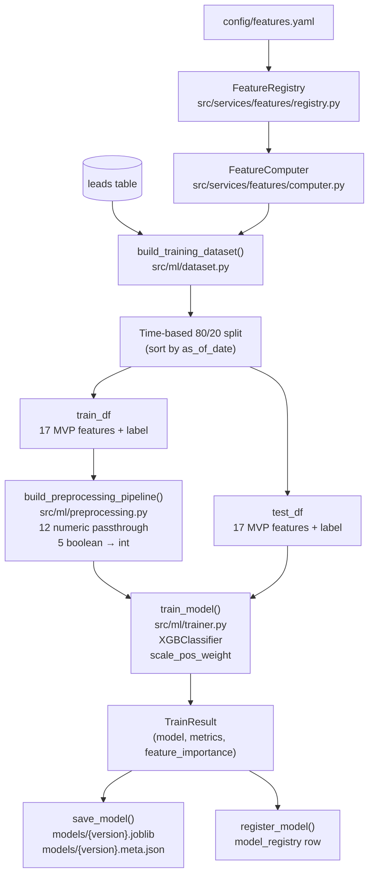

# ML Model: Lead Scoring

This document covers the full ML pipeline from feature engineering through model serialization.

For how raw data gets into the leads table, see [data-pipeline.md](data-pipeline.md).
For the `model_registry` table schema, see [database.md](database.md).

---

## Feature Engineering

### FeatureComputer (`src/services/features/computer.py`)

`FeatureComputer` is the orchestrator for feature computation. It accepts an `AsyncEngine` at construction and exposes two async methods:

- `compute(lead_id, as_of_date=None)` — computes features for a single lead.
- `compute_batch(lead_ids, as_of_dates=None)` — computes features for a list of leads, with a per-lead `as_of_date` dict.

Internally, both methods query the lead and its events via SQLAlchemy (using `selectinload` for eager loading), then call `_compute_for_lead()`, which:

1. Filters events to those with `occurred_at < as_of_date` (point-in-time safety).
2. Iterates over all registered features, calling each computation function.
3. Passes raw results through `validate_features()`.
4. Appends `lead_id` and `computed_at` to the result dict.

### Feature Registry (`src/services/features/registry.py`)

`FeatureRegistry` loads `config/features.yaml` at import time and holds a singleton instance (`registry`) shared across all definition modules. It maps feature names to computation functions via the `@registry.register("feature_name")` decorator.

Key methods:
- `register(name)` — decorator that registers a function for a named feature; raises `KeyError` if the name is not in `features.yaml`.
- `computed_features()` — returns the set of features that have a registered function.
- `defaulted_features()` — returns features defined in YAML but without a registered function (i.e., firmographic placeholders).
- `get_function(name)` / `get_default(name)` / `get_metadata(name)` — accessors.

### Validation (`src/services/features/validation.py`)

`validate_features(raw, registry, lead_id=None)` checks each feature against its YAML-defined type:

- `numeric` — must be a finite `int` or `float` (not NaN, not inf).
- `boolean` — must be exactly `bool`.
- `categorical` — must be a value in the feature's `categories` list.

If a value is invalid or absent, it is replaced with the YAML `default` and a warning is logged. The function always returns a dict with all 20 features defined in `features.yaml`.

### Feature Categories

Features are defined in `src/services/features/definitions/` and organized into six modules:

| Category | Module | Features |
|---|---|---|
| Recency | `recency.py` | `days_since_last_visit`, `days_since_last_email_open`, `days_since_first_touch` |
| Frequency | `frequency.py` | `total_pageviews_7d`, `total_pageviews_30d`, `total_sessions`, `emails_opened_30d`, `emails_clicked_30d` |
| Intensity | `intensity.py` | `avg_pages_per_session`, `avg_session_duration_seconds`, `pricing_page_views` |
| Intent | `intent.py` | `viewed_pricing`, `requested_demo`, `downloaded_content`, `visited_competitor_comparison` |
| Engagement | `engagement.py` | `engagement_velocity_7d`, `is_engagement_increasing` |
| Firmographic | `firmographic.py` | `company_size_bucket`, `industry_match_icp`, `job_title_seniority` *(unregistered — see below)* |

The firmographic module intentionally registers no functions. Those features require CRM data not available in the current dataset and will always return their YAML defaults until Phase 7.

### Point-in-Time Support

Every computation function receives `as_of_date` as its third argument. `FeatureComputer._compute_for_lead()` pre-filters the event list to `occurred_at < as_of_date` before passing it to any feature function, ensuring that features cannot look into the future relative to the evaluation date.

---

## Preprocessing (`src/ml/preprocessing.py`)

The preprocessing pipeline handles 17 MVP features: 12 numeric and 5 boolean.

**12 numeric features** (`NUMERIC_FEATURES`) — passed through unchanged (XGBoost handles numeric inputs natively):

```
days_since_last_visit, days_since_last_email_open, days_since_first_touch,
total_pageviews_7d, total_pageviews_30d, total_sessions,
emails_opened_30d, emails_clicked_30d, avg_pages_per_session,
avg_session_duration_seconds, pricing_page_views, engagement_velocity_7d
```

**5 boolean features** (`BOOLEAN_FEATURES`) — cast to `int` (0/1) via `FunctionTransformer`:

```
viewed_pricing, requested_demo, downloaded_content,
visited_competitor_comparison, is_engagement_increasing
```

**3 firmographic placeholders** (`FIRMOGRAPHIC_PLACEHOLDERS`) are excluded from MVP training:

```
company_size_bucket, industry_match_icp, job_title_seniority
```

`build_preprocessing_pipeline()` returns a sklearn `Pipeline` wrapping a `ColumnTransformer` with two named transformers: `"numeric"` (passthrough) and `"boolean"` (FunctionTransformer). The combined list `MVP_FEATURE_NAMES = NUMERIC_FEATURES + BOOLEAN_FEATURES` defines the 17-column input the model expects.

---

## Training

`scripts/train.py` orchestrates the full training flow. Entry point:

```
poetry run python scripts/train.py [--tune] [--set-active]
```

### Dataset (`src/ml/dataset.py`)

`build_training_dataset(engine, test_fraction=0.2)` builds labeled train/test DataFrames:

1. Queries all leads where `converted IS NOT NULL`. Leads with `converted=True` but no `converted_at` are filtered out.
2. Queries the latest event date per lead for use in as_of_date computation.
3. Computes a point-in-time `as_of_date` for each lead via `compute_as_of_date()`:
   - **Converted leads**: `converted_at - 1 day`
   - **Non-converted leads**: `min(created_at + 90 days, now, latest_event_at)`
4. Calls `FeatureComputer.compute_batch()` with the per-lead as_of_date map.
5. Drops `lead_id`, `computed_at`, and firmographic placeholder columns. Adds `converted` (label) and `as_of_date`.
6. Sorts by `as_of_date` and splits at the 80th percentile for a **time-based 80/20 split** — earlier records go to train, later records to test.

### Model (`src/ml/trainer.py`)

`train_model(X_train, y_train, X_test, y_test, preprocessing_pipeline, hyperparameters=None)` returns a `TrainResult`.

The model is an `XGBClassifier` wrapped in a sklearn `Pipeline` alongside the preprocessing steps. `scale_pos_weight` is set automatically as `n_negative / n_positive` to handle class imbalance.

**Default hyperparameters** (`DEFAULT_HYPERPARAMETERS`):

| Parameter | Value |
|---|---|
| `n_estimators` | 200 |
| `max_depth` | 6 |
| `learning_rate` | 0.1 |
| `subsample` | 0.8 |
| `colsample_bytree` | 0.8 |
| `eval_metric` | `logloss` |
| `random_state` | 42 |

### Optional Tuning (`src/ml/tuning.py`)

The `--tune` flag triggers `tune_hyperparameters(X_train, y_train, preprocessing_pipeline)` before calling `train_model()`. It runs `GridSearchCV` with:

- `scoring="roc_auc"`
- `StratifiedKFold(n_splits=5, shuffle=True, random_state=42)`
- `n_jobs=-1` (parallel)

**Default parameter grid** (`DEFAULT_PARAM_GRID`):

| Parameter | Values |
|---|---|
| `n_estimators` | 100, 200, 300 |
| `max_depth` | 4, 6, 8 |
| `learning_rate` | 0.05, 0.1, 0.2 |
| `subsample` | 0.7, 0.8, 0.9 |

The function returns the best hyperparameter dict (unprefixed), which is passed directly to `train_model()`.

---

## Evaluation

After training, `train_model()` evaluates the model on the holdout set and returns these metrics in `TrainResult.metrics`:

| Metric | Description |
|---|---|
| `auc_roc` | Area under the ROC curve |
| `precision` | Positive predictive value |
| `recall` | Sensitivity / true positive rate |
| `f1` | Harmonic mean of precision and recall |
| `log_loss` | Cross-entropy loss |
| `calibration_error` | Expected Calibration Error (ECE, equal-frequency bins) |

Feature importances are extracted from `XGBClassifier.feature_importances_` and stored in `TrainResult.feature_importance` as a `{feature_name: float}` dict.

### Score Buckets

The model outputs a probability score in [0, 1]. The API maps this to a letter grade using thresholds configurable via environment variables:

| Grade | Condition | Default threshold |
|---|---|---|
| A | score ≥ `MODEL_BUCKET_A_THRESHOLD` | 0.7 |
| B | score ≥ `MODEL_BUCKET_B_THRESHOLD` | 0.4 |
| C | score ≥ `MODEL_BUCKET_C_THRESHOLD` | 0.2 |
| D | score < `MODEL_BUCKET_C_THRESHOLD` | — |

---

## Serialization & Registry (`src/ml/serialization.py`)

After training, `scripts/train.py` saves the artifact and registers it in the database.

**`save_model(model, version, metrics, hyperparameters, feature_columns, base_dir=Path("models"))`**

Writes two files to `models/`:
- `{version}.joblib` — the fitted sklearn `Pipeline` (preprocessing + XGBClassifier).
- `{version}.meta.json` — metrics, hyperparameters, feature columns, and `trained_at` timestamp.

**`load_model(artifact_path)`**

Loads and returns the sklearn `Pipeline` from a `.joblib` file.

**`next_version(existing_versions)`**

Auto-increments the minor version from the highest existing version string (e.g., `["v1.0", "v1.1"]` → `"v1.2"`). Returns `"v1.0"` when no versions exist. Major bumps are manual and intended for Phase 7+ when the feature set changes.

**`register_model(engine, version, artifact_path, metrics, hyperparameters, feature_columns, set_active=False)`**

Inserts a row into the `model_registry` table. If `set_active=True`, all existing rows are first updated to `is_active=False`, then the new row is inserted with `is_active=True`. Returns the new model's UUID.

See [database.md](database.md) for the `model_registry` table schema.

---

## Pipeline Diagram


