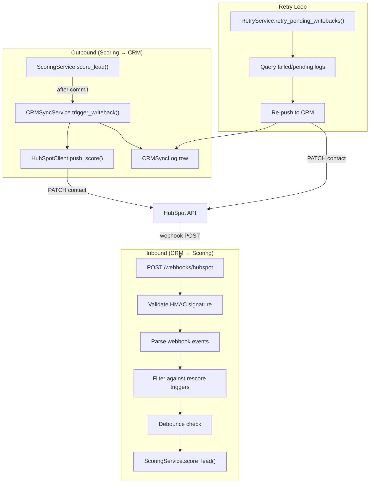

## Overview

The CRM integration layer provides bidirectional sync between the lead scoring system and external CRM platforms. Scores computed by the ML model are pushed back to the CRM, and webhook events from the CRM trigger automatic rescoring when lead properties change.

Currently implemented: **HubSpot**. Salesforce is stubbed with full field mapping configuration but no client implementation.

---

## Architecture



---

## Components

### `src/services/crm/base.py` — Abstract Interface

`CRMClient` defines the contract that all CRM implementations must satisfy:

| Method | Purpose |
|--------|---------|
| `push_score(external_id, score, bucket, top_factors, model_version)` | Write score properties to a CRM contact |
| `fetch_contact(external_id)` | Retrieve a single contact's mapped fields |
| `fetch_contacts(filters, cursor)` | Paginated contact search |
| `validate_webhook(method, uri, headers, body)` | Verify webhook request signature |
| `parse_webhook_event(payload)` | Normalize CRM payload into `WebhookEvent` objects |
| `close()` | Cleanup hook (close HTTP client, etc.) |

`WebhookEvent` is a dataclass with fields: `external_id`, `change_type` (`"property_change"` | `"engagement"`), `changed_fields`, `raw`.

### `src/services/crm/hubspot.py` — HubSpot Client

Implements `CRMClient` for the HubSpot v3 REST API using `httpx.AsyncClient`.

**Authentication:** OAuth Bearer token (`CRM_HUBSPOT_ACCESS_TOKEN`).

**Score writeback:** `PATCH /crm/v3/objects/contacts/{external_id}` with field-mapped properties (score, bucket, top factors, model version, timestamp).

**Contact fetch:** `GET /crm/v3/objects/contacts/{external_id}` with a `properties` query parameter listing the mapped fields.

**Bulk fetch:** `POST /crm/v3/objects/contacts/search` with `filterGroups` and cursor-based pagination. Returns `(contacts, next_cursor)`.

**Webhook validation:**
- Computes HMAC-SHA256 over `{method}{uri}{body}{timestamp}` using the client secret
- Compares against the `x-hubspot-signature-v3` header
- Rejects timestamps older than 5 minutes (replay protection)
- Returns `False` (not validated) if no `CRM_WEBHOOK_CLIENT_SECRET` is configured

**Event parsing:** Translates HubSpot subscription types:
- `contact.propertyChange` → `change_type="property_change"` with `changed_fields=[propertyName]`
- Other types → `change_type="engagement"`

**Error mapping:**

| HTTP Status | Exception |
|-------------|-----------|
| 404 | `CRMContactNotFoundError` |
| 429 | `CRMRateLimitError` (carries `Retry-After` value) |
| Other 4xx/5xx | `CRMWritebackError` |

### `src/services/crm/sync.py` — Score Writeback Orchestrator

`CRMSyncService` is called fire-and-forget from `ScoringService.score_lead()` after the prediction is committed to the database.

**Behavior:**
1. Checks `lead.source_system` — only triggers for `{"hubspot", "salesforce"}`, skips `"kaggle"` leads
2. Calls `crm_client.push_score()` with the score result
3. Writes a `CRMSyncLog` row for every attempt:
   - **Success:** `status="success"`, `synced_at` set
   - **Failure:** `status="failed"`, `error_message` populated
4. The `payload` field always contains the score, bucket, top_factors, and model_version for auditability

The writeback does not block the scoring response — the client receives their score regardless of CRM push outcome.

### `src/services/crm/retry.py` — Failed Writeback Retry

`retry_pending_writebacks(session, crm_client, max_retries=5, delay_seconds=300)` sweeps `crm_sync_log` for rows with:
- `status` in `("pending", "failed")`
- `retry_count < max_retries`
- `updated_at` older than `delay_seconds`

Each row is re-attempted individually. On success, status is set to `"success"` and `synced_at` is updated. On failure, `retry_count` is incremented and `error_message` is updated.

Returns a summary: `{"attempted": N, "succeeded": N, "failed": N}`.

Designed to be invoked from a cron job or scheduled task.

### `src/services/crm/factory.py` — Client Factory

`get_crm_client(settings)` returns the appropriate client based on `CRM_TYPE`:

| `CRM_TYPE` | Result |
|------------|--------|
| `"none"` | `None` (CRM disabled) |
| `"hubspot"` | `HubSpotClient` instance |
| `"salesforce"` | `NotImplementedError` |

### `src/services/crm/errors.py` — Exception Hierarchy

```
CRMError
├── CRMAuthError
├── CRMRateLimitError(retry_after: int)
├── CRMContactNotFoundError(external_id: str)
└── CRMWritebackError
```

### `src/services/crm/mock.py` — Test Double

`MockCRMClient` records all calls for assertion in tests. Supports configurable error injection and canned webhook responses.

---

## Webhook Processing

### `POST /webhooks/hubspot`

Full flow for an incoming HubSpot webhook:

1. **No CRM client** → returns `{"status": "received", "processed": 0}` (graceful no-op)
2. **Signature validation** → `crm_client.validate_webhook()` → 401 if invalid
3. **JSON parse** → 400 if malformed
4. **Event parsing** → `crm_client.parse_webhook_event(payload)` → `list[WebhookEvent]`
5. **Trigger filtering** → each event is checked against `rescore_triggers` from `config/crm.yaml`:
   - Property changes: `changed_fields` must overlap with `rescore_triggers.property_changes`
   - Engagements: `subscriptionType` must contain a string from `rescore_triggers.engagement_types`
6. **Lead lookup** → queries `leads` where `external_id` matches and `source_system="hubspot"`
7. **Debounce** → skips rescoring if the lead was scored within `CRM_RESCORE_DEBOUNCE_SECONDS` (default 60s)
8. **Rescore** → calls `scoring_service.score_lead(lead.id)` (which also triggers writeback)

**Response:** `{"status": "received", "processed": N}` where N is the count of leads actually rescored.

### `POST /webhooks/salesforce`

Stub endpoint. Returns `200` with `{"status": "received", "message": "Salesforce webhooks not yet implemented"}`.

---

## Field Mapping

CRM fields are mapped via `config/crm.yaml`. The integration layer translates between internal field names and CRM-specific property names.

### HubSpot Mappings

**Contact fields** (CRM → internal):

| Internal Name | HubSpot Property |
|---------------|------------------|
| `email` | `email` |
| `first_name` | `firstname` |
| `last_name` | `lastname` |
| `company_name` | `company` |
| `company_size` | `numberofemployees` |
| `job_title` | `jobtitle` |
| `industry` | `industry` |
| `phone` | `phone` |
| `lifecycle_stage` | `lifecyclestage` |
| `lead_status` | `hs_lead_status` |
| `created_at` | `createdate` |
| `updated_at` | `lastmodifieddate` |

**Output fields** (internal → CRM):

| Internal Name | HubSpot Property |
|---------------|------------------|
| `score` | `lead_score` |
| `bucket` | `lead_score_bucket` |
| `top_factors` | `lead_score_factors` |
| `scored_at` | `lead_score_updated` |
| `model_version` | `lead_score_model_version` |

These HubSpot custom properties must be created in the HubSpot portal before score writeback will work.

### Rescore Triggers

Events from HubSpot that trigger automatic rescoring:

**Property changes:** `lifecyclestage`, `jobtitle`, `numberofemployees`, `industry`

**Engagement types:** `PAGE_VIEW`, `EMAIL_OPEN`, `EMAIL_CLICK`, `FORM_SUBMISSION`

---

## Data Model

### `crm_sync_log` Table

Tracks every CRM writeback attempt for auditability.

| Column | Type | Notes |
|--------|------|-------|
| `id` | UUID | PK |
| `lead_id` | UUID | FK → leads.id (RESTRICT delete) |
| `source_system` | VARCHAR(20) | `"hubspot"`, `"salesforce"` |
| `external_id` | VARCHAR(100) | CRM contact ID |
| `action` | VARCHAR(50) | `"score_update"` |
| `payload` | JSONB | `{score, bucket, top_factors, model_version}` |
| `status` | VARCHAR(20) | `"success"` / `"failed"` / `"pending"` (CHECK constraint) |
| `error_message` | TEXT | Exception details on failure |
| `synced_at` | TIMESTAMP(tz) | Set on successful push |
| `retry_count` | INT | Default 0, incremented on retry failure |
| `created_at` | TIMESTAMP(tz) | Auto-set |
| `updated_at` | TIMESTAMP(tz) | Auto-updated |

**Indexes:** `(lead_id)`, `(status)`, `(source_system, external_id)`

### Lead Model Extensions

The `leads` table uses `external_id` (unique) and `source_system` to associate leads with their CRM origin. The `source_system` field determines whether CRM writeback is triggered: only `"hubspot"` and `"salesforce"` sources activate the sync service.

---

## Integration Points

### App Startup

During lifespan startup, `create_crm_client(settings)` is called via the factory. The returned client (or `None`) is stored on `app.state.crm_client`. On shutdown, `close()` is called to release HTTP resources.

### Dependency Injection

```python
# src/api/dependencies.py
def get_crm_client(request) -> CRMClient | None:
    return getattr(request.app.state, "crm_client", None)

async def get_scoring_service(...) -> ScoringService:
    crm_client = get_crm_client(request)
    crm_sync = CRMSyncService(session, crm_client) if crm_client else None
    return ScoringService(..., crm_sync_service=crm_sync)
```

### Scoring Pipeline Integration

`ScoringService.score_lead()` fires the CRM writeback after committing the prediction:

```
compute features → model inference → assign bucket → persist prediction → commit
                                                                              ↓
                                                            CRMSyncService.trigger_writeback()
                                                                              ↓
                                                            HubSpotClient.push_score() + CRMSyncLog
```

---

## Configuration

### Environment Variables

| Variable | Type | Default | Notes |
|----------|------|---------|-------|
| `CRM_TYPE` | `"hubspot"` \| `"salesforce"` \| `"none"` | `"none"` | Set to `"hubspot"` to enable |
| `CRM_HUBSPOT_ACCESS_TOKEN` | str | — | HubSpot private app or OAuth token |
| `CRM_WEBHOOK_CLIENT_SECRET` | str | — | For webhook HMAC validation |
| `CRM_RESCORE_DEBOUNCE_SECONDS` | int | `60` | Minimum seconds between rescores for the same lead |

Salesforce env vars (`CRM_SALESFORCE_*`) are defined in settings but not yet functional.

### YAML Configuration

`config/crm.yaml` contains:
- `hubspot.contact_fields` — inbound field mapping
- `hubspot.output_fields` — outbound field mapping
- `hubspot.rescore_triggers` — webhook event filters
- `hubspot.event_types` — event type translation
- `salesforce.*` — equivalent mappings (prepared for future implementation)
- `company_size_mapping` — raw CRM values → internal buckets
- `icp` — ideal customer profile criteria

---

## Salesforce Readiness

The following infrastructure is in place for a future Salesforce implementation:

- Factory routing (`crm_type == "salesforce"`)
- Full field mappings in `config/crm.yaml` (with `__c` custom field suffixes)
- Environment variable definitions for Salesforce OAuth
- Webhook endpoint at `POST /webhooks/salesforce`
- Abstract `CRMClient` contract

What remains: implementing `SalesforceClient` in `src/services/crm/salesforce.py` with OAuth JWT bearer flow, SOQL queries, and Platform Event/Outbound Message webhook handling.

---

## Design Decisions

**Fire-and-forget writeback** — The scoring response is returned immediately; CRM push happens after commit. If the push fails, it's logged and retried later. This keeps scoring latency low and decouples CRM availability from the scoring API.

**Audit trail** — Every CRM writeback attempt (success or failure) creates a `crm_sync_log` row. This provides full observability into what was pushed, when, and whether it succeeded.

**HMAC-SHA256 + timestamp validation** — Webhook signatures use the HubSpot v3 signing scheme with a 5-minute timestamp window, preventing replay attacks.

**Debouncing** — Rapid webhook bursts (e.g., multiple property changes in quick succession) are collapsed into a single rescore via a configurable time window (default 60s).

**YAML-driven field mapping** — Field name translation is configured externally, not hardcoded. Adding a new CRM field mapping requires only a YAML change.

**Abstract CRM interface** — The `CRMClient` ABC allows swapping CRM implementations without changing the scoring pipeline, sync service, or webhook handler.
